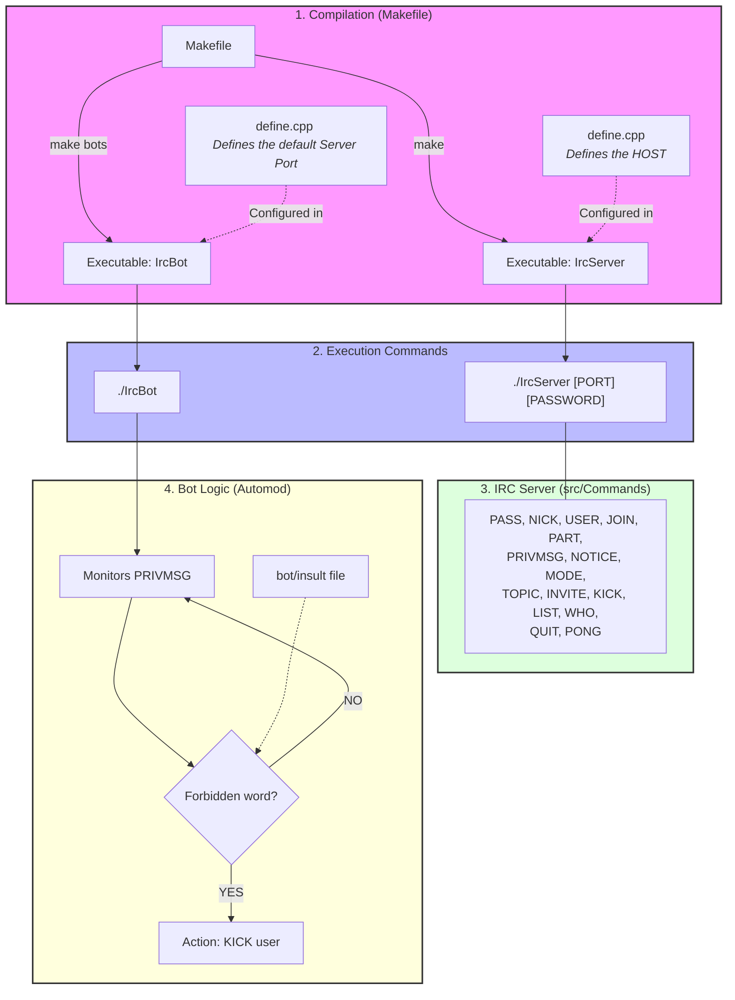

# IrcServer

## Architecture

## Makefile

- `make` : compile `IrcServer`.
  - Le host est défini dans `inc/Define.hpp` (macro `HOST`).
- `make bots` : compile `IrcBot` (alias de `make bot`).

## Exécution

- Serveur : `./IrcServer [PORT] [PASSWORD]`
- Bot : `./IrcBot [PORT]`

## IRC Server — commandes implémentées (`src/Commands`)

- `PASS`
- `NICK`
- `USER`
- `JOIN`
- `PART`
- `PRIVMSG`
- `NOTICE`
- `MODE`
- `MODE_utils`
- `TOPIC`
- `INVITE`
- `KICK`
- `LIST`
- `WHO`
- `QUIT`
- `PINGPONG`

## Bot

- Le bot surveille les messages `PRIVMSG`.
- Si un utilisateur envoie un mot interdit (liste dans `bot/insult`) :
  - le bot envoie un `KICK` sur le channel,
  - puis envoie un `PRIVMSG` à l'utilisateur expulsé.

## Sources

https://www.codequoi.com/envoyer-et-intercepter-un-signal-en-c/

https://www.undernet.org/docs/irc-quit-message-faq

https://modern.ircdocs.horse/#rpltopicwhotime-333

https://mathieu-lemoine.developpez.com/tutoriels/irc/protocole/?page=generalites

