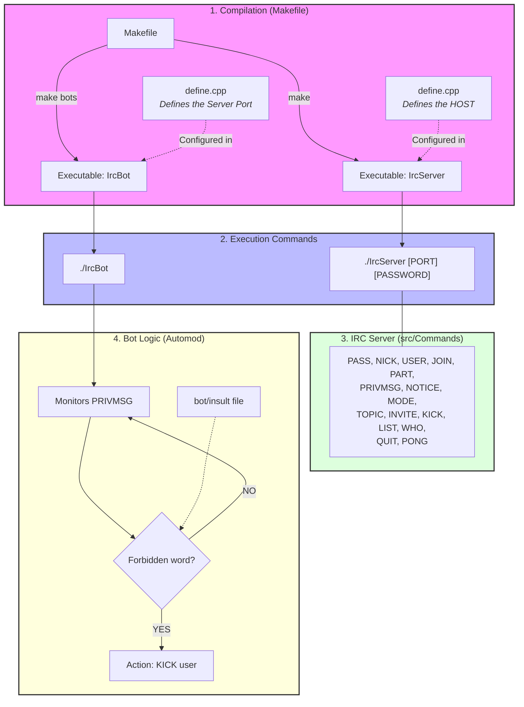

<i> This project has been created as part of the 42 curriculum by pde-petr, karamire, lpaysant <i> 

# IrcServer

## Description

### IRC definition

IRC (Internet Relay Chat) is a text discussion protocol. It allows different clients connected in real-time to communicate on a server.  
The project we created is the development of an IRC server, based on the [RFC 2119](https://datatracker.ietf.org/doc/html/rfc2119) standard. The client we selected for our tests is HexChat, which is quite complete.

### Our project
On this server we can:
    - set up a password for connection
    - create and/or `JOIN` a channel
    - communicate on the channel or privately to a user (`PRIVMSG`)
    - get the `LIST` of channels 
    - have operators (channel administrators) on channels
                    the commands operators(`MODE`) : 
                        - `i`: Set/remove Invite-only channel
                        - `t`: Set/remove the restrictions of the TOPIC command to channel operators
                        - `k`: Set/remove the channel key (password)
                        - `o`: Give/take channel operator privilege
                        - `l`: Set/remove the user limit to channel
    - `INVITE` other server clients to join a channel
    - `KICK` users from a channel

In parallel we have a bot (automated client) that can kick users if they send obscenities
- The bot monitors `PRIVMSG` messages.
- If a user sends a forbidden word (list in `bot/insult`):
  - the bot sends a `KICK` on the channel,
  - then sends a `PRIVMSG` to the expelled user.

### Architecture

## Instructions 

### Makefile

#### make Server

`make` : compile `IrcServer`.
> **Warning** - The host must be defined beforehand in `inc/Define.hpp` (macro `HOST`).

#### make bot

- `make bots` : compile `IrcBot` (alias for `make bot`).
> **Warning** - The port used by the server must be defined in `bot/Bot.hpp` (macro `PORT`).

### Execution

- Server: `./IrcServer [PORT] [PASSWORD]`
- Bot: `./IrcBot`

### IRC Server — commands implemented (`src/Commands`)

- `PASS`
- `NICK`
- `USER`
- `JOIN`
- `PART`
- `PRIVMSG`
- `NOTICE`
- `MODE`
- `TOPIC`
- `INVITE`
- `KICK`
- `LIST`
- `WHO`
- `QUIT`
- `PONG`

## Sources

https://www.codequoi.com/envoyer-et-intercepter-un-signal-en-c/

https://www.undernet.org/docs/irc-quit-message-faq

https://modern.ircdocs.horse/#rpltopicwhotime-333

https://mathieu-lemoine.developpez.com/tutoriels/irc/protocole/?page=generalites

