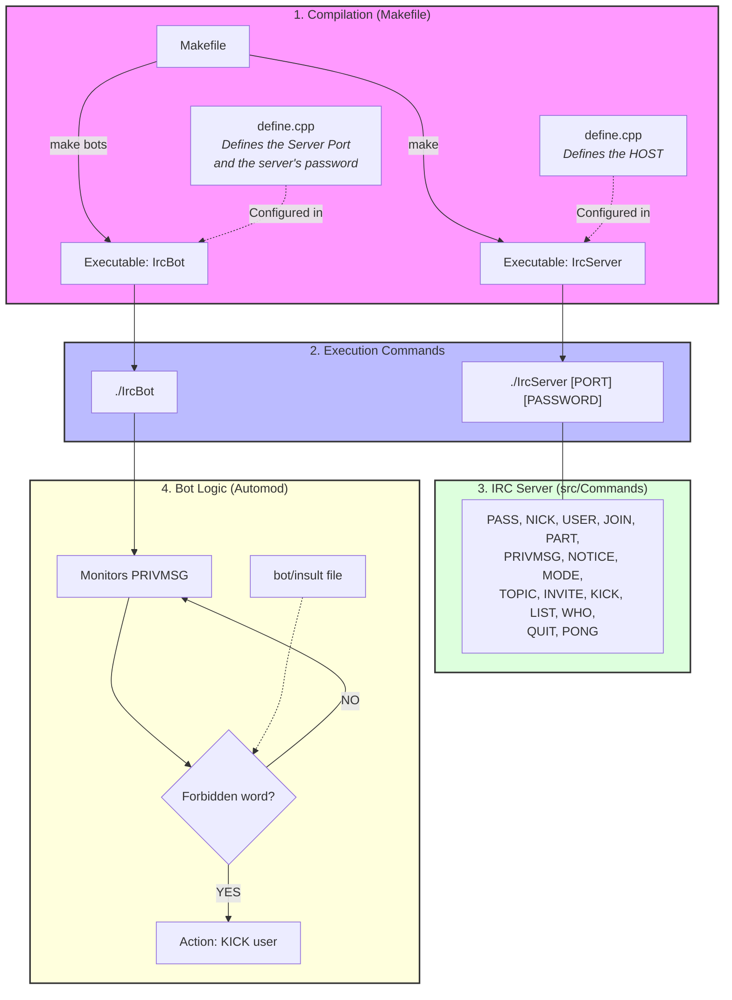

<i> This project has been created as part of the 42 curriculum by pde-petr, karamire, lpaysant </i> 

# IrcServer

## Description

### IRC definition

IRC (Internet Relay Chat) is a text discussion protocol. It allows different clients connected in real-time to communicate on a server.  
The project we created is the development of an IRC server, based on the [RFC 2119](https://datatracker.ietf.org/doc/html/rfc2119) standard. The client we selected for our tests is HexChat, which is quite complete.

### Our project
<ul>
<li> set up a password for connection</li>
<li> create and/or <code>JOIN</code> a channel</li>
<li> communicate on the channel or privately to a user (<code>PRIVMSG</code>)</li>
<li> get the <code>LIST</code> of channels </li>
<li> have operators (channel administrators) on channels</li>
<li>the commands operators(<code>MODE</code>):</li> 
<ul>
<li><code>i</code>: Set/remove Invite-only channel</li>

<li><code>t</code>: Set/remove the restrictions of the TOPIC command to channel operators</li>
<li><code>k</code>: Set/remove the channel key (password)</li>
<li><code>o</code>: Give/take channel operator privilege</li>
<li><code>l</code>: Set/remove the user limit to channel</li>
</ul>
<li><code>INVITE</code> other server clients to join a channel</li>
<li><code>KICK</code> users from a channel</li>
</ul>
 
In parallel we have a bot (automated client) that can kick users if they send obscenities:
 
<ul>
<li>The bot monitors <code>PRIVMSG</code> messages</li>
<li>If a user sends a forbidden word (list in <code>bot/insult</code>):</li>
<li>the bot sends a <code>KICK</code> on the channel</li>
<li>then sends a <code>PRIVMSG</code> to the expelled user</li>
</ul>

### Architecture

## Instructions 

### Makefile

#### make Server

`make` : compile `IrcServer`.
> **Warning** - The host must be defined beforehand in `inc/Define.hpp` (macro `HOST`).

#### make bot

- `make bots` : compile `IrcBot` (alias for `make bot`).
> **Warning** - The port used by the server must be defined in `bot/Bot.hpp` (macro `PORT`).

### Execution

- Server: `./IrcServer [PORT] [PASSWORD]`
- Bot: `./IrcBot`

### IRC Server — commands implemented (`src/Commands`)

- `PASS`
- `NICK`
- `USER`
- `JOIN`
- `PART`
- `PRIVMSG`
- `NOTICE`
- `MODE`
- `TOPIC`
- `INVITE`
- `KICK`
- `LIST`
- `WHO`
- `QUIT`
- `PONG`

## Ressources

https://www.codequoi.com/envoyer-et-intercepter-un-signal-en-c/

https://www.undernet.org/docs/irc-quit-message-faq

https://modern.ircdocs.horse/

IA is use for help comprehension protocol IRC, comprehension error with our code and traduction Readme but not to generate it.

